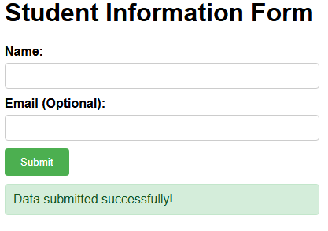
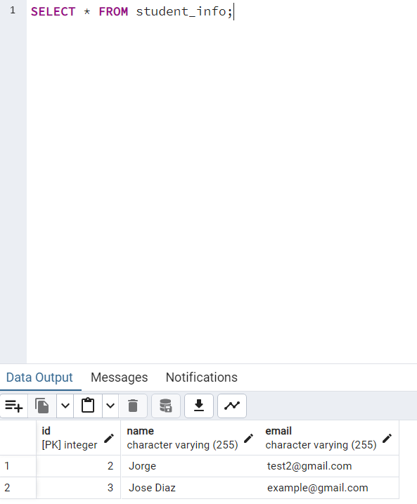

# Student Information App

A simple web application developed for students to see how the backend and frontend work together. This application provides a web form to collect student information (name and email) and stores it in a PostgreSQL database. It uses Flask for the backend server, SQLAlchemy for database operations, JavaScript for asynchronous form submission, and HTML/CSS for the user interface.




## Prerequisites

Before running this application, ensure you have the following:

-   Python 3.6+
-   PostgreSQL database
-   `pip` package installer

## Setup

1.  **Clone the repository:**

    ```bash
    git clone <repository_url>
    cd student_app
    ```

2.  **Create a virtual environment:**

    ```bash
    python -m venv venv
    ```

3.  **Activate the virtual environment:**

    -   On Windows:

        ```bash
        venv\Scripts\activate
        ```

    -   On macOS and Linux:

        ```bash
        source venv/bin/activate
        ```

4.  **Install the dependencies:**

    ```bash
    pip install -r requirements.txt
    ```
5. **Create the database:**

    -   Create a PostgreSQL database.
    -   Run the following SQL query to create the `student_info` table:

        ```sql
        CREATE TABLE student_info (
            id SERIAL PRIMARY KEY,
            name VARCHAR(100) NOT NULL,
            email VARCHAR(100)
        );
        ```

6.  **Configure the database:**

    -   Create a `.env` file in the root directory of the application.
    -   Add the following environment variables, replacing the values with your actual database credentials:

        ```
        DB_HOST=<your_db_host>
        DB_NAME=<your_db_name>
        DB_USER=<your_db_user>
        DB_PASSWORD=<your_db_password>
        DB_PORT=<your_db_port>
        ```

## Usage

1.  **Run the application:**

    ```bash
    python app.py
    ```

2.  **Open the application in your web browser:**

    -   Navigate to `http://127.0.0.1:5000/` (or the address shown in the console when you run the app).

3.  **Submit the form:**

    -   Enter your name and email in the form fields.
    -   Click the "Submit" button.

4.  **Verify the submission:**

    -   A success message will be displayed upon successful submission.
    -   The data will be stored in the `student_info` table in your PostgreSQL database.

## Technologies Used

-   Flask: Web framework
-   SQLAlchemy: ORM for database interaction
-   PostgreSQL: Database
-   dotenv: For managing environment variables

## Project Structure

```
student_app/
│
├── app.py                 # Flask application and database models
│
├── static/
│   └── script.js          # JavaScript for form handling
│   └── style.css          # CSS styling
│
└── templates/
    └── index.html         # HTML form template
```

## API Endpoints

- `GET /` - Renders the student information form
- `POST /submit` - Endpoint for submitting student data

## Usage

1. Fill out the student information form with name (required) and email (optional).
2. Submit the form.
3. The data will be stored in the PostgreSQL database.
4. Success or error messages will be displayed on the form page.
